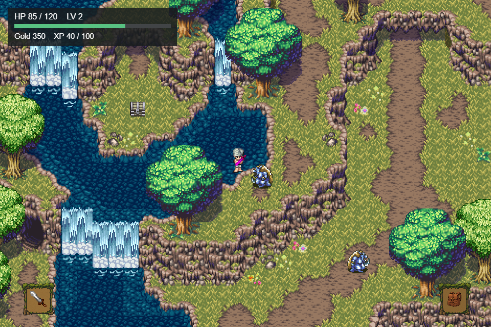
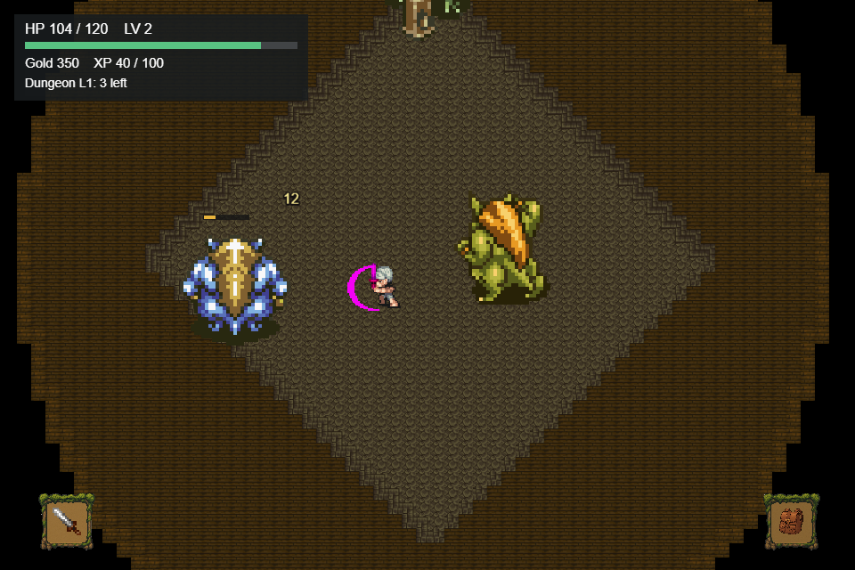
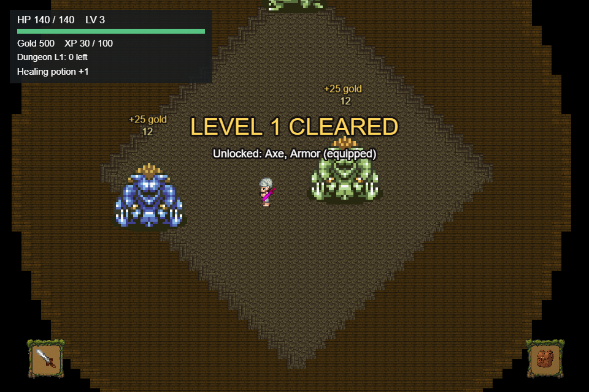
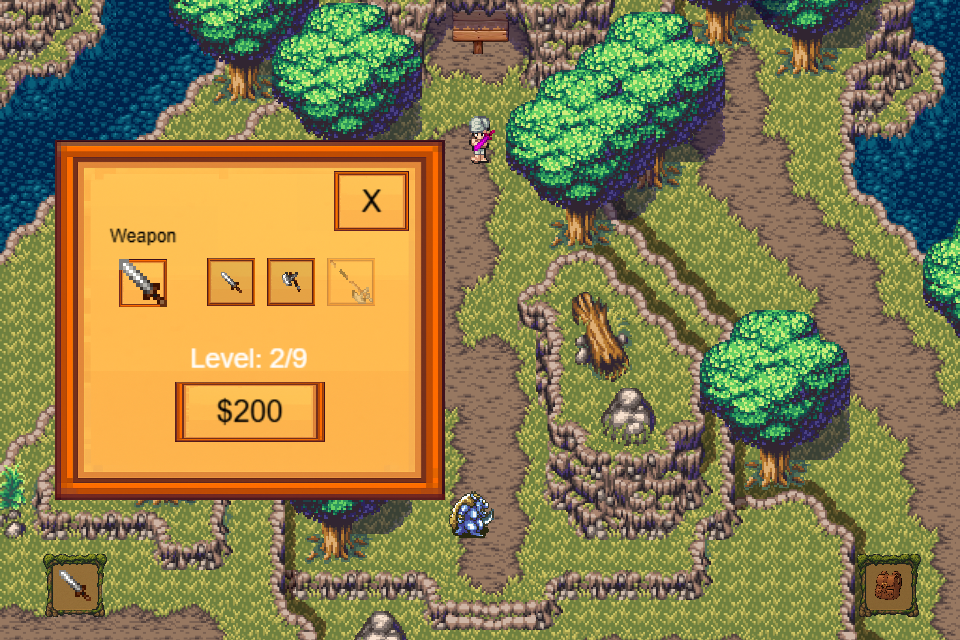
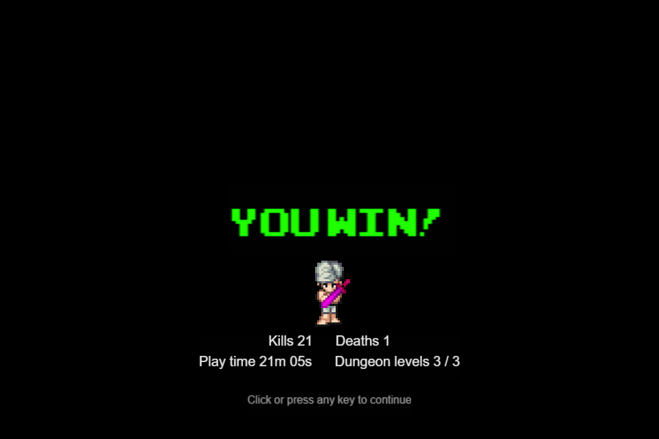

# Dungeon Crawler

A top-down pixel-art action RPG built with Cocos Creator 2.4.8. Explore a village and a forest full of goblins, collect gold and potions, upgrade your weapons, then fight through three increasingly dangerous dungeon levels. It plays in the browser with a keyboard or on a phone with touch controls.

**Play it: https://dungeon-crawler-8c503.web.app**

<p align="center">
  
</p>

| | |
|:---:|:---:|
|  |  |
| Enemies flash yellow before they swing; health bars and damage numbers show every hit | Clearing a dungeon level unlocks new gear |
|  |  |
| Switch weapons and buy upgrades with gold | Every run ends with a summary |

## Contents

- [How to play](#how-to-play)
- [Running the project](#running-the-project)
- [Testing](#testing)
- [Building and deploying](#building-and-deploying)
- [Project layout](#project-layout)
- [Troubleshooting](#troubleshooting)
- [Credits](#credits)

## How to play

### Controls

| Action | Keyboard | Touch screen |
|---|---|---|
| Move | `W` `A` `S` `D` or arrow keys | Drag on the left half of the screen |
| Attack | `Space` (hold to keep swinging) | Tap or hold the right half of the screen |
| Items (potions) | `I` or the bag button | Bag button (bottom right) |
| Equipment and upgrades | `E` or the sword button | Sword button (bottom left) |
| Close a menu | `Escape` | The menu's close button |
| Start from the main menu | `Enter` or **START** | **START** |

Touch controls appear automatically on touch devices.

### The journey

1. **Create your character.** A new game opens the character creator: type a name, pick one of five skin tones with the arrows, and mix hair and outfit colors with the red, green and blue sliders. Press **OK** to begin. Your look is saved and used in every scene, and your name appears in the top-left panel.
2. **Home** is where every later session starts. Walk into the house and step on the rest spot to heal fully and save, or follow the **Overworld** sign.
3. **The Overworld** is a forest with seven patrolling goblins. Each kill earns gold and XP, and every second kill also drops a healing potion.
4. **The dungeon sign** at the top of the Overworld opens the level select. Level 1 is open from the start; each cleared level unlocks the next.
5. **In the dungeon**, defeat all three goblins to clear the level: a Goblin, a Goblin Swordsman and the Goblin Boss. Enemies hold a wind-up pose and flash yellow just before they swing, so step out of range or strike first.
6. Clearing level 1 or 2 returns you to the Overworld with your rewards. **Clearing level 3 wins the game.**

If your health reaches zero, the Game Over screen shows your run so far and you return to the main menu. You keep your gold, items and unlocks, respawn at full health, and the death is added to your death count.

### Weapons

| Weapon | Damage (upgrade tier 1 / 2 / 3) | Time between swings | How to unlock |
|---|---|---|---|
| Sword | 5 / 10 / 15 | 0.5s / 0.4s / 0.3s | Available from the start |
| Axe | 10 / 15 / 20 | 0.7s | Clear dungeon level 1, or reach upgrade level 4 |
| Spear | 15 / 20 / 25 | 0.4s | Clear dungeon level 2, or reach upgrade level 7 |

Every player level above 1 adds 2 damage to all weapons.

**Upgrades** are bought in the equipment menu. There are 9 upgrade levels and each costs 100 gold × your current level (100 gold for the first, 800 for the last). Levels 2–3 improve the sword, 5–6 the axe and 8–9 the spear; levels 4 and 7 unlock the axe and spear.

### Items and armor

| Item | Effect | Start with |
|---|---|---|
| Healing potion | Restores 30 HP (not used up at full health) | 3 |
| Defense potion | +5 defense for 15 seconds | 1 |
| Invulnerability potion | Take no damage for 5 seconds | 1 |
| Armor | +3 defense while worn; granted and worn when you first clear a dungeon level | — |

In the equipment menu (`E`), the **Armor** row shows your armor: click it to put it on or take it off, or click the Armor slot to take it off. A yellow frame marks the weapon and armor you are using. Active potion effects and their remaining time are shown in the panel at the top left. Defense reduces the damage of every hit, but every hit still deals at least 1.

### Rewards and levels

- A goblin gives **25 gold and 20 XP**; the Goblin Boss gives **100 gold and 50 XP**.
- Every **100 XP** is a level up: +20 max HP, +1 defense, +2 attack, and a full heal.
- You start with **250 gold**.

### Dungeon difficulty

All three dungeon levels use the same arena and the same three goblins, which get tougher on each level:

| Level | Enemy health | Enemy damage |
|---|---|---|
| 1 | ×1 | ×1 |
| 2 | ×1.5 | ×1.25 |
| 3 | ×2 | ×1.5 |

### Saving

The game saves automatically to the browser's `localStorage` when you change area, rest at home, use an item, change equipment, buy an upgrade or clear a dungeon level. Kills in the Overworld are saved the next time you change area. Your character's look and name are saved when you press **OK** in the character creator.

To start over, choose **NEW GAME** on the main menu and click it a second time to confirm. It erases everything, including your character, and opens the character creator. It only appears once a save exists.

## Running the project

### Requirements

- [Cocos Creator 2.4.8](https://www.cocos.com/en/creator/download), installed through Cocos Dashboard. Use exactly 2.4.x; the project targets the `cocos-creator-js` engine and does not open in Cocos Creator 3.
- [Node.js](https://nodejs.org/) 22 or newer, for the tests and repair tools.
- [Firebase CLI](https://firebase.google.com/docs/cli), only for deploying.

### Open and play

1. In Cocos Dashboard, choose **Add** and select this folder.
2. Open it with Cocos Creator 2.4.8. The first import can take a few minutes.
3. Open `assets/scenes/Main Menu.fire` and press **Play** (▶) at the top of the editor. The game opens in your browser at `http://localhost:7456`.

The preview always starts from the scene open in the editor, so open **Main Menu** first to play from the beginning.

## Testing

```bash
npm install
npm test               # unit and data tests, no editor needed
npm run test:preview   # plays through the game in a headless browser
```

`npm test` runs in a few seconds and checks:

- **Combat:** damage, defense, potions, enemy wind-up timing and knockback.
- **Saves:** loading damaged or old saves, inventory persistence, dungeon rewards and progression.
- **Draw order:** the depth sorting that lets characters walk behind scenery.
- **Assets:** every sprite atlas links to its image, animation clips use the right layers, scene references and button handlers resolve, and inventory icons exist.

`npm run test:preview` drives the real game running in the Cocos Creator preview. It moves, attacks, uses items, buys upgrades, clears dungeon levels 1 and 3, dies, and starts a new game, and it fails on any runtime error. It needs Cocos Creator open on this project with the preview server running on port 7456 (set `COCOS_PREVIEW_URL` to use another address). Screenshots from each run are saved in `temp/verification/`.

Cocos Creator only re-imports files that changed on disk when its window regains focus. After editing scripts, scenes or `.meta` files outside the editor, click into the editor window before running the preview test.

## Building and deploying

The game is hosted on Firebase Hosting in project `dungeon-crawler-8c503` (set in `.firebaserc`) at https://dungeon-crawler-8c503.web.app. Firebase serves the `build/web-mobile` folder, which is not committed, so build before every deploy.

### 1. Build

In Cocos Creator, open **Project > Build**, choose **Web Mobile**, keep **Build Path** as `build`, keep **MD5 Cache** checked and **Debug** unchecked, then click **Build**. The start scene (**Main Menu**) and the excluded prototype scenes are already saved in the build settings.

Alternatively, build from a terminal while the project is closed in the editor:

```powershell
& "C:\ProgramData\cocos\editors\Creator\2.4.8\CocosCreator.exe" --path . --build "platform=web-mobile;debug=false;md5Cache=true"
```

If that prints `bad option: --path`, the terminal (for example VS Code's) set `ELECTRON_RUN_AS_NODE`. Run `Remove-Item Env:ELECTRON_RUN_AS_NODE` and try again.

### 2. Test the build locally

```bash
firebase emulators:start --only hosting        # serves build/web-mobile at http://127.0.0.1:5000
```

Play it in a browser, or run the full playthrough test against it from a second terminal:

```bash
COCOS_PREVIEW_URL=http://127.0.0.1:5000 npm run test:preview
```

### 3. Deploy

```bash
firebase login                 # once per computer
firebase deploy --only hosting
```

Only files that changed are uploaded. To deploy to a different Firebase project, run `firebase use --add` and pick it.

### Caching

The build gives every file a content hash in its name except `index.html`. `firebase.json` tells browsers to cache the hashed files for a year and to always recheck `index.html`, so returning players load quickly and still get each new version as soon as it is deployed. Keep **MD5 Cache** enabled in the build settings, or players could keep running old files.

## Project layout

```text
assets/
  scenes/               Game scenes (see below)
  scripts/
    core/               GameManager (scene flow, saving, rewards, HUD) and DepthSort (draw order)
    controllers/        CameraFollow, plus player/ and enemy/ movement, combat and stats
    managers/           Inventory, main menu, end screens, signs and the rest spot
    ui/                 Dungeon level select and touch controls
  resources/
    data/               Default player state, weapon stats and the item database (loaded at runtime)
    Inventory/          Item icons
  sprites/              Player, goblin and weapon sprite atlases and animation clips
  finalTileMap/         Tiled maps and tilesets for Home, HomeInside and the Overworld
  DUNGEONFINALMEN/      Tiled map for the dungeon arena
  prefabs/              Enemies, inventory UI, map props and the dungeon popup
tests/                  Unit tests (*.test.cjs) and the browser smoke test (preview-smoke.cjs)
tools/                  Repair and asset-generation scripts
docs/screenshots/       Images used in this README
```

| Scene | Purpose |
|---|---|
| `Main Menu` | Start, New Game and the controls hint |
| `CharacterCustomization` | Character creation: name, skin tone, hair and outfit colors |
| `Home` | Starting area outside the house |
| `HomeInside` | Rest spot that heals fully and saves |
| `Overworld` | Forest with goblins, chests and the dungeon sign |
| `Dungeon_2` | Arena used for all three dungeon levels |
| `Game_Over`, `Game_Win` | End-of-run summary |

`testing` is a developer sandbox and is excluded from builds. The `EnemyAI`, `PatrolDebugTest` and `PopUpVillage` scripts are leftovers that no playable scene uses.

`assets/Dungeon Maps/` holds three unfinished level layouts (a five-room dungeon, a cave and a round boss arena) that no scene uses yet. Their tileset images came from an `itch.io assets` folder that was never added to the repository, so they cannot be loaded until those images are restored or the maps are redrawn with tilesets in the project.

### Adding content

- **Scenery characters can walk behind** (trees, logs, tunnel arches) goes in a node directly under `Canvas` whose name starts with `Group of`. At runtime, `DepthSort` sorts those sprites with the player and enemies by where each one touches the ground: stand above a tree's trunk and its canopy hides you, stand below it and you are drawn in front. Give each object a `PhysicsBoxCollider` at its base; otherwise the bottom edge of its sprite is used.
- **Enemies** are easiest to add by dragging the `Goblin` or `GoblinSword` prefab from `assets/prefabs/enemy/` directly under `Canvas`. Tune `EnemyController`'s `attackWindup`, `attackCooldown`, `damage` and `knockbackSpeed` in the inspector (0 makes an enemy immovable), and give it `waypoints` to patrol. In `Dungeon_2`, every active enemy must be defeated to clear the level.
- **Weapon stats** live in `assets/resources/data/weapons.json`; **items** live in `assets/resources/data/InventoryDatabase.json`.

### Repair tools

These scripts fix known problems in scene and asset files. They only change what is broken, so they are safe to re-run.

| Command | What it fixes |
|---|---|
| `node tools/repair-atlas-textures.cjs` | Points each Texture Packer `.plist` at the image beside it. A plist naming a missing image imports frames with no picture, which made the player's body vanish while walking. |
| `node tools/repair-scene-bindings.cjs` | Restores the dungeon level buttons, boss tuning, the Overworld bag icon, the equipment panel's armor row, player animation bindings, and the character creation scene (missing font and images, and its controller wiring). |
| `node tools/repair-player-animations.cjs` | Rebuilds the layered player animation clips (body, hair, clothes and weapon). |
| `node tools/generate-armor-icon.cjs` | Redraws the armor icon, `assets/resources/Inventory/armor.png`. |
| `node tools/optimize-images.cjs` | Shrinks UI images that were exported far larger than they are drawn (the start button, bag icon, button frame, panel background and the character creation frames), which keeps the web build near 15MB instead of 23MB. It skips images that are already small enough. |

## Troubleshooting

| Problem | Fix |
|---|---|
| Build fails with "Build path can't include space" | Cocos Creator 2.4 cannot build into a path with spaces, and this project may sit under a folder like `Dungeon Crawler`. Either rename that folder, or create a space-free link to the project (PowerShell: `New-Item -ItemType Junction -Path C:\Users\<you>\dungeon-crawler -Target "<project folder>"`) and open the project from the link in Cocos Dashboard. Builds then land in the same `build/web-mobile` folder. |
| Changes don't show up in the preview | Click into the Cocos Creator window so it re-imports changed files, then reload the preview page. |
| The preview starts in the wrong scene | The preview plays the scene open in the editor; open `Main Menu` first. |
| A character or object is invisible, or shows the wrong image | Run `node tools/repair-atlas-textures.cjs`, click into the editor, then run `npm test`. |
| You want to reset your progress | Use **NEW GAME** on the main menu, or clear the site's local storage in the browser. |
| `npm run test:preview` can't connect | Make sure Cocos Creator is open on this project and its preview is running at `http://localhost:7456`. |
| The live game loads slowly or stops near the end of the loading bar | Some networks deliver HTTP/3 (QUIC) traffic from Firebase's CDN very slowly, even though the same files arrive in about 2 seconds over HTTP/2. Firebase does not let a site turn HTTP/3 off. Try another network, such as mobile data, or for testing, set Chrome's `chrome://flags/#enable-quic` to **Disabled**. |
| `firebase deploy` fails with a permission error | You are logged in to an account without access to `dungeon-crawler-8c503`. Check with `firebase login:list`, then switch accounts or run `firebase use --add` to pick your own project. |

## Credits

- Made with Cocos Creator 2.4.8.
- The ArcadeClassic font is © Jakob Fischer ([pizzadude.dk](https://www.pizzadude.dk)) and free for non-commercial use only; see `assets/Fonts/arcadeclassic/pizzadudedotdk.txt`.
- Tilesets, character sprites and sound effects in `assets/` come from third-party asset packs. Check each pack's license before using this project commercially.
